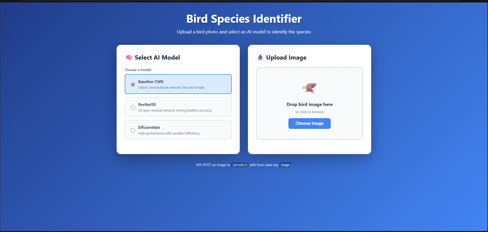
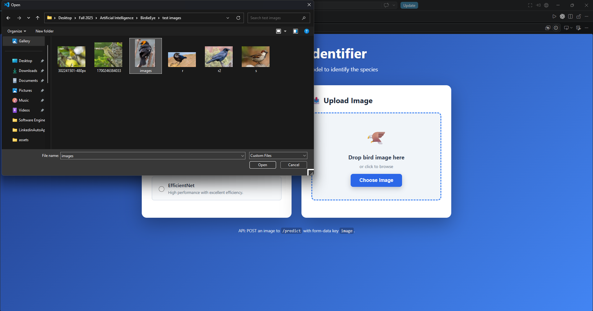
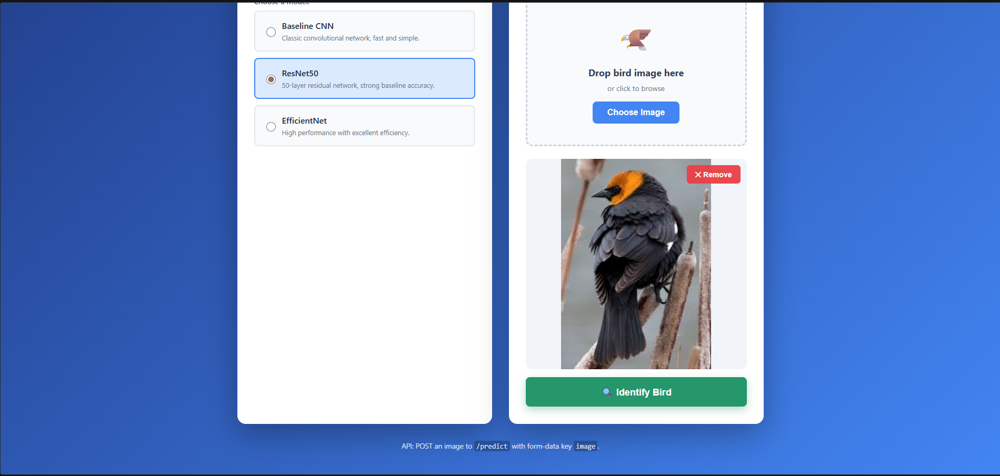
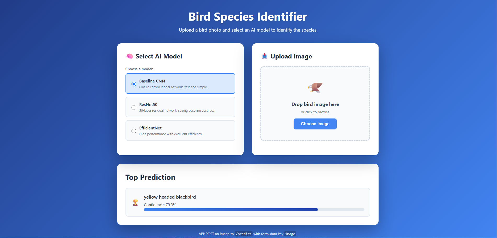

# BirdieEye

BirdieEye is a deep learning bird recognition project that detects birds in images and classifies bird species using multiple CNN-based models. The project includes a Flask web app where users can upload a bird image, select a model, and receive a prediction.

## Feature

- Bird object detection
- Bird species classification
- Image upload through a Flask web interface
- JSON prediction API
- Support for multiple deep learning models

## Demo 

| Step | Screenshot |
|------|------------|
| **1. Launch the web application** |  |
| **2. Upload a bird image** |  |
| **3. Select one of the four models** |  |
| **4. View the prediction results** |  |

## Models

This project includes 4 trained models:

1. Baseline CNN Bird Object Detector
2. Baseline CNN Bird Species Classifier
3. ResNet50 Bird Species Classifier
4. EfficientNet Bird Species Classifier

## Tech Stack

- Python
- Flask
- TensorFlow / Keras
- NumPy
- Matplotlib
- scikit-learn
- Docker
- HTML / CSS


## Project Structure

```text
BirdieEye/
├── app.py
├── requirements.txt
├── class_name.json
├── Dockerfile
├── test-agent.h5
├── labels.txt
├── templates/
│   └── index.html
└── static/
```

## Trained Model Download Link

The trained vision models are not stored directly in this repository because the files are too large for GitHub. I have instead uploaded them to this google drive link:
[Download trained models](https://drive.google.com/file/d/1c6LfUSzJgaKwcR7MyVBCdiK2_-5dPa9G/view?usp=sharing)

After downloading:

1. Extract the zip file.
2. Move the 4 trained model files into the project root directory.
3. Make sure the model filenames match the names expected by `app.py`.

Example structure:

```text
BirdieEye/
├── app.py
├── requirements.txt
├── baseline_bird_detector.h5
├── baseline_bird_classifier.h5
├── resnet50_bird_classifier.h5
├── efficientnet_bird_classifier.h5
└── .....

```

## Setup
1. Create and activate a virtual environment (optional but recommended).
   a. running via the docker container, go to the file directory, execute all the following command in order
   ```bash
   docker build -t birdie .
   docker run -p 8080:8080 birdie
   ```
   b. visit https://localhost:8080
3. Install dependencies:
   ```bash
   pip install -r requirements.txt
   ```
4. Place your trained Keras model at `test-agent.h5` in this folder. Optionally add a `labels.txt` file (one class label per line) to map class indices to species names.

## Run the server
```bash
export FLASK_APP=app.py
flask run --host=0.0.0.0 --port=5000
```
Then open http://localhost:5000 to use the upload form.

## API
`POST /predict` with `form-data` key `image` containing a JPG/PNG file.

Response (example):
```json
{
  "species": "northern_cardinal",
  "confidence": 0.93,
  "raw_prediction": [0.01, 0.93, 0.06]
}
```

If the model cannot be loaded, the service returns an error indicating the missing `test-agent.h5`.
